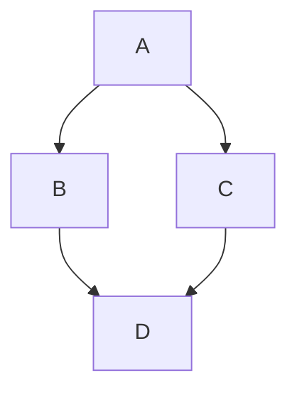

# Java_21

--------------

[//]: # (version: 1.0)
[//]: # (author: Iván Rodríguez)
[//]: # (date: 2025-07-20)


# Tabla de contenidos
- [Java\_21](#java_21)
- [Tabla de contenidos](#tabla-de-contenidos)
  - [Introducción](#introducción)
  - [Instalación](#instalación)
    - [Seccion1](#seccion1)
  - [📘 Capítulo 2: Sintaxis del Lenguaje en Java](#-capítulo-2-sintaxis-del-lenguaje-en-java)
    - [📌 2.1 Sintaxis Básica](#-21-sintaxis-básica)
  - [🏷️ Etiquetas JavaDoc más comunes](#️-etiquetas-javadoc-más-comunes)
    - [🔤 2.2 Secuencias de Escape](#-22-secuencias-de-escape)
    - [🔢 2.3 Tipos de Datos Primitivos](#-23-tipos-de-datos-primitivos)
    - [🧠 2.4 Variables](#-24-variables)
    - [🔁 2.5 Operadores](#-25-operadores)
      - [Aritméticos ➕➖✖️➗](#aritméticos-️)
      - [Asignación 📝](#asignación-)
      - [Comparación 🔍](#comparación-)
      - [Lógicos 🧩](#lógicos-)
        - [🧠 Tablas de la Verdad en Java](#-tablas-de-la-verdad-en-java)
          - [✅ AND lógico (`&&`)](#-and-lógico-)
          - [✅ OR lógico (`||`)](#-or-lógico-)
          - [🔄 XOR lógico (`^`)](#-xor-lógico-)
          - [🔁 NOT lógico (`!`)](#-not-lógico-)
    - [ℹ️ Notas:](#ℹ️-notas)
      - [Bits 🔧](#bits-)
      - [Otros](#otros)
    - [🗑️ 2.6 Recolector de Basura (Garbage Collector)](#️-26-recolector-de-basura-garbage-collector)
    - [🧭 2.7 Instrucciones de Control](#-27-instrucciones-de-control)
      - [Condicionales ❓](#condicionales-)
      - [Bucles 🔁](#bucles-)
      - [Salida anticipada 🚪](#salida-anticipada-)
    - [📦 2.8 Arrays](#-28-arrays)
  - [Capitulo 3](#capitulo-3)
    - [Seccion1](#seccion1-1)
    - [Seccion2](#seccion2)
      - [Seccion2.1](#seccion21)
  - [Clases](#clases)
  - [Clase 01 - 24/10](#clase-01---2410)
  - [4. Arrays](#4-arrays)
    - [4.1. Arrays multidimensionales](#41-arrays-multidimensionales)
    - [Citas Coloreadas](#citas-coloreadas)


<div style="page-break-after: always;"></div>


## Introducción
[Tabla de contenidos](#tabla-de-contenidos)

- URL
  - 
  - 




```java

```

## Instalación
[Tabla de contenidos](#tabla-de-contenidos)

### Seccion1
[Tabla de contenidos](#tabla-de-contenidos)

<div style="page-break-after: always;"></div>

## 📘 Capítulo 2: Sintaxis del Lenguaje en Java

### 📌 2.1 Sintaxis Básica
- Java es **sensible a mayúsculas y minúsculas** 🔠
- Las sentencias **terminan en punto y coma (;)** ✔️
- Los bloques de código se delimitan con **llaves { }** 🧱
- Comentarios:
  - `//` Comentario de una línea
  - `/* ... */` Comentario de varias líneas
  - `/** ... */` Comentario para documentación JavaDoc

## 🏷️ Etiquetas JavaDoc más comunes

| Etiqueta     | Función                                                             | Emoji     |
|--------------|----------------------------------------------------------------------|-----------|
| `@author`    | Indica el autor del código                                           | 👤        |
| `@version`   | Muestra la versión del archivo o clase                               | 🧾        |
| `@date`      | Fecha de creación de clase o métodos                                 | 🧾        |
| `@param`     | Describe un parámetro de un método                                   | 🏷️        |
| `@return`    | Describe lo que devuelve un método                                   | 🔁        |
| `@throws`    | Indica una excepción que puede lanzar un método                      | ⚠️        |
| `@exception` | Igual que `@throws` (forma alternativa)                              | 🚨        |
| `@see`       | Enlace a otra clase o método relacionado                             | 🔗        |
| `@since`     | Indica desde qué versión está disponible una clase o método          | ⏳        |
| `@deprecated`| Señala que algo está obsoleto y no debe usarse                       | ❌        |
| `@serial`    | Documenta una propiedad serializable                                 | 💾        |
| `@code`      | Muestra texto con estilo de código en la documentación               | 💻        |
| `@link`      | Inserta un enlace interno a otro elemento de JavaDoc                 | 🔗        |
| `@inheritDoc`| Hereda el comentario de la superclase o interfaz                     | 🧬        |


### 🔤 2.2 Secuencias de Escape
Permiten representar caracteres especiales dentro de cadenas:
- `\n` salto de línea
- `\t` tabulación
- `\\` barra invertida
- `\"` comilla doble

### 🔢 2.3 Tipos de Datos Primitivos
Java tiene **8 tipos primitivos**:
- Enteros: `byte`, `short`, `int`, `long` 🧮
- Decimales: `float`, `double` 🔬
- Carácter: `char` 🔤
- Booleano: `boolean` (true/false) ✔️❌

### 🧠 2.4 Variables
- Declaración: `tipo nombre;`
- Inicialización: `nombre = valor;`
- **Tipos**: primitivos y objetos (por referencia)
- **Ámbitos**: atributos (de clase) y locales (dentro de métodos)
- **Valores por defecto**: 0, false, null...

### 🔁 2.5 Operadores
#### Aritméticos ➕➖✖️➗
- `+`, `-`, `*`, `/`, `%`, `++`, `--`
- Concatenación de strings con `+`

#### Asignación 📝
- `=`, `+=`, `-=`, `*=`, `/=`, `%=` (operadores compuestos)

#### Comparación 🔍
- `==`, `!=`, `<`, `>`, `<=`, `>=`

#### Lógicos 🧩
- `&&` (y), `||` (o), `!` (no)

##### 🧠 Tablas de la Verdad en Java

###### ✅ AND lógico (`&&`)
- La salida siempre será false, excepto cuando TODAS las entradas son true
  
| A     | B     | A && B |
|-------|-------|--------|
| true  | true  | true   |
| true  | false | false  |
| false | true  | false  |
| false | false | false  |

---

###### ✅ OR lógico (`||`)
- La salida siempre será true, excepto cuando TODAS las entradas son false

| A     | B     | A \|\| B |
|-------|-------|----------|
| true  | true  | true     |
| true  | false | true     |
| false | true  | true     |
| false | false | false    |

---

- La salida será false si TODAS las entradas son iguales
  - Todo circuito se puede hacer usando SOLO puertas NOR o NAND

###### 🔄 XOR lógico (`^`)
| A     | B     | A ^ B |
|-------|-------|--------|
| true  | true  | false  |
| true  | false | true   |
| false | true  | true   |
| false | false | false  |


---

###### 🔁 NOT lógico (`!`)
| A     | !A    |
|-------|-------|
| true  | false |
| false | true  |

---

### ℹ️ Notas:
- `&&` y `||` son operadores **cortocircuitados**: si el resultado se puede determinar evaluando solo la primera expresión, Java no evalúa la segunda.
- `^` funciona como **XOR lógico**, útil con booleanos.
- También existen versiones **bit a bit** (`&`, `|`, `^`) aplicables a enteros.


#### Bits 🔧
- `&`, `|`, `^`, `~`

#### Otros
- `instanceof` verifica tipo de objeto
- Operador ternario: `(condición) ? valor_si_true : valor_si_false`

### 🗑️ 2.6 Recolector de Basura (Garbage Collector)
- Elimina objetos no referenciados automáticamente.
- Se activa cuando no quedan referencias (`obj = null;`).

### 🧭 2.7 Instrucciones de Control
#### Condicionales ❓
- `if`, `else`, `switch`

#### Bucles 🔁
- `for`, `while`, `do...while`

#### Salida anticipada 🚪
- `break`: sale del bucle
- `continue`: salta a la siguiente iteración

### 📦 2.8 Arrays
- Colección de elementos del mismo tipo 📚
- Declaración: `tipo[] nombre = new tipo[tamaño];`
- Inicialización rápida: `int[] nums = {1,2,3};`
- Uso de `.length` para longitud
- Se pueden pasar como argumentos y devolver desde métodos
- Soporta **multidimensionales** y **irregulares**
- Bucle `for-each` para recorrerlos fácilmente

---

¿Quieres este mismo resumen como presentación o material para imprimir? 🎓


<div style="page-break-after: always;"></div>


## Capitulo 3
[Tabla de contenidos](#tabla-de-contenidos)

- Recursos: 
  - 

```php
echo "Hola Mundo";
```

### Seccion1
[Tabla de contenidos](#tabla-de-contenidos)

```console
#...
```


### Seccion2
[Tabla de contenidos](#tabla-de-contenidos)

```console
#...
```


#### Seccion2.1
[Tabla de contenidos](#tabla-de-contenidos)

1. **negrita**

```console
sudo apt update
sudo apt upgrade
```

2. Hm^3^
    - H~2~O

- dfgdlfkgdlfkj
- dflgjdlfkj

- [X] Hm^3^
    - H~2~O


## Clases 
[Tabla de contenidos](#tabla-de-contenidos)


## Clase 01 - 24/10
[Tabla de contenidos](#tabla-de-contenidos)

- [Web Notable](https://notable.app/)
  - https://notable.app/static/pdfs/cheatsheet.pdf
- [ ] https://github.com/twbs/bootstrap
- [ ] https://github.com/mermaid-js/mermaid

---

- [Apuntes de Docker](Docker.md "Introducción")

> IMPORTANTE: Para hacer una captura de pantalla simplemente hazla y pegala!!


:angel::angel::angel::angel:
```python
user = "fulano"
```


## 4. Arrays
[Tabla de contenidos](#tabla-de-contenidos)

```console
#
```

### 4.1. Arrays multidimensionales
[Tabla de contenidos](#tabla-de-contenidos)

```console
#
```


### Citas Coloreadas
[Tabla de contenidos](#tabla-de-contenidos)

> [!NOTE]  
> Highlights information that users should take into account, even when skimming.

> [!TIP]
> Optional information to help a user be more successful.

> [!IMPORTANT]  
> Crucial information necessary for users to succeed.

> [!WARNING]  
> Critical content demanding immediate user attention due to potential risks.

> [!CAUTION]
> Negative potential consequences of an action.


